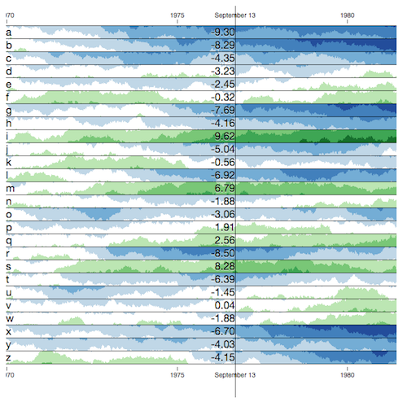

## R/horizon: horizon charts via cubism.js

[](https://github.com/kbroman/horizon/actions)

Inspired by <https://gist.github.com/bae25/10797393>, we use
[cubism.js](http://square.github.io/cubism/),
[d3.js](https://d3js.org), and
[htmlwidgets](http://www.htmlwidgets.org) to create a static horizon chart
from R.

### Installation

Install from GitHub using the
[remotes](https://remotes.r-lib.org) package:

```r
install.packages("remotes")
remotes::install_github("kbroman/horizon")
```

### Try it out!

```r
library(horizon)
example(horizon)
```


